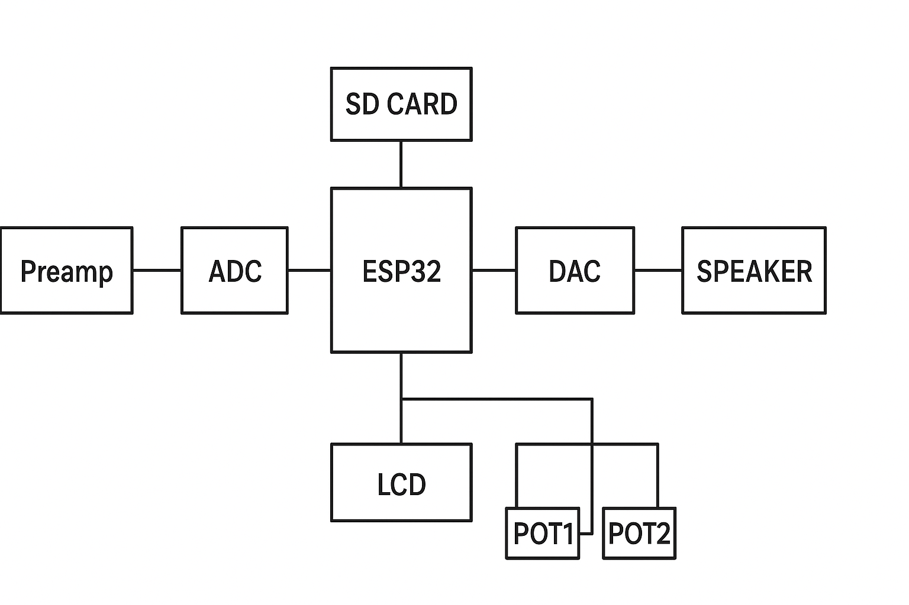
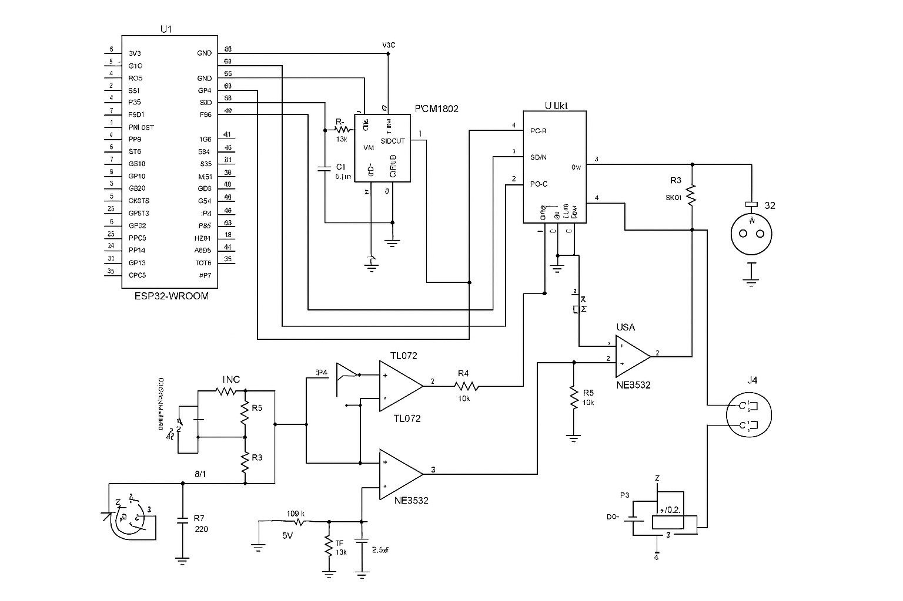

# **IoT Device for Digital Audio Processing Using ESP32**
**Author:** Gabriel Pascoli Terezo  
**Institution:** Inteli – Instituto de Tecnologia e Liderança  
**Advisor:** Prof. Rafael Matsuyama  
**Date:** 2025  

---

# **Abstract**
This work presents the development of an IoT-enabled embedded system for capturing, processing and amplifying audio signals from musical instruments, with emphasis on electric guitar.  
The device integrates an analog front-end, high-fidelity ADC/DAC converters using the I²S protocol, a digital signal processing pipeline implemented on the ESP32 microcontroller, impulse-response (IR) simulation, wireless connectivity, local storage via SD-card, and a 7W Class-D power amplifier.

The goal is to build a compact, low-cost, open-source alternative to commercial digital multi-effects units, capable of real-time audio processing while enabling IoT capabilities such as remote control, preset management and wireless streaming.

**Keywords:** DSP, IoT, ESP32, electric guitar, audio processing, impulse response, embedded systems.

---

# **Resumo**
Este trabalho apresenta o desenvolvimento de um sistema embarcado IoT para captura, processamento e amplificação de sinais de instrumentos musicais, com foco em guitarra elétrica.  
O dispositivo integra um front-end analógico, conversores ADC/DAC de alta fidelidade via I²S, um pipeline de processamento digital em ESP32, simulação de caixa acústica por resposta ao impulso (IR), conectividade sem fio, armazenamento em cartão SD e amplificador classe D de 7W.

O objetivo é criar uma alternativa compacta, acessível e open-source às pedaleiras digitais comerciais, oferecendo processamento em tempo real e recursos IoT para controle remoto e gerenciamento de presets.

**Palavras-chave:** DSP, IoT, ESP32, guitarra elétrica, áudio digital, resposta ao impulso.

---

# **1. Introduction**

Modern audio systems increasingly merge analog electronics, embedded digital processing and network connectivity. Devices such as Line 6 HX Stomp, Mooer GE Series and iRig HD demonstrate the demand for compact solutions capable of real-time effects, amplifier modeling and integration with mobile apps.

However, commercial equipment is typically:

- expensive,
- closed-source,
- non-customizable for research.

This project develops an **ESP32-based IoT audio processor**, combining:

- analog pre-amplifier (TL072),
- PCM1802 ADC + PCM5102A DAC,
- real-time DSP on ESP32 (I²S),
- impulse-response engine,
- Class-D 7W amplifier,
- OLED display + encoder + potentiometers,
- Wi-Fi/Bluetooth for control and streaming,
- SD-card storage.

The system operates both as a **digital pedalboard** and a **mini-amplifier** for guitars.

---

# **2. Literature Review**

## 2.1 Digital Audio Processing  
Fundamental works such as Oppenheim (2010) and Smith (2007) describe discrete-time signal processing, FIR/IIR filters, sampling theory and convolution techniques.

## 2.2 Impulse Response Simulation  
Zölzer (2011) defines efficient partitioned convolution, enabling amplifier and cabinet simulation on embedded hardware.

## 2.3 Embedded Audio and IoT  
Huang et al. (2018) explore IoT audio platforms focusing on low latency and wireless streaming.

## 2.4 Analog Electronics for Guitars  
The TL072 op-amp is widely used in guitar preamps due to:

- low noise figure,
- high input impedance,
- stable behavior.

Class-D amplifiers are preferred for compact solutions due to high efficiency.

---

# **3. Methodology**

The project followed an **agile workflow** divided into development sprints:

### **Sprints 1–3**
- Research
- Hardware studies
- DSP fundamentals

### **Sprints 4–7**
- Analog preamp prototyping
- I²S interface and ADC/DAC validation

### **Sprints 8–12**
- DSP effects implementation
- IR loader development
- Real-time audio pipeline stabilization

### **Sprints 13–15**
- Amplifier integration
- UI/UX (OLED + encoder)
- IoT features (Wi-Fi / BLE)

### **Sprint 16**
- Final tests
- Noise reduction
- Documentation and repository structuring

---

# **4. System Architecture**

The overall architecture is shown in Figure 1.

## **Figure 1 – System Architecture**


### The system consists of the following subsystems:

- **Analog front-end** (TL072 preamp)  
- **PCM1802 ADC**  
- **ESP32 DSP Engine (I²S)**  
- **PCM5102A DAC**  
- **Class-D 7W amplifier**  
- **UI controls** (OLED, encoder, pots)  
- **IoT module** (Wi-Fi/BLE)  
- **SD-card storage**  

---

# **5. Hardware Development**

## 5.1 Analog Preamp (TL072)

The preamp performs:

- high-impedance buffering (1 MΩ),
- adjustable gain (5×–20×),
- high-pass filtering,
- soft clipping for ADC protection.

### **Figure 2 – Analog Signal Path**


---

## 5.2 ADC/DAC Conversion (I²S)

- **ADC PCM1802** (24-bit, low noise)
- **DAC PCM5102A** (32-bit)
- Sample rate: **48 kHz**
- Communication: **I²S full duplex**

---

## 5.3 Full Hardware Schematic

### **Figure 3 – Complete Schematic**


---

## 5.4 7W Class-D Amplifier

Used for:

- speakers,
- external cabinets,
- headphones (with attenuation).

### **Figure 4 – Amplifier Circuit**


---

# **6. Software & DSP Implementation**

## 6.1 Processing Pipeline

1. Capture audio via I²S  
2. Normalize and buffer samples  
3. Apply DSP effects:
   - Noise Gate  
   - EQ (3-band biquad)  
   - Waveshaping distortion  
   - IR convolution (FFT-based)  
4. Limiting  
5. Send processed data to DAC  
6. Amplify output  

---

## 6.2 Example: Biquad Filter

```cpp
y[n] = a0*x[n] + a1*x[n-1] + a2*x[n-2]
     - b1*y[n-1] - b2*y[n-2];

6.3 IR Convolution (FFT)

Uses:

Partitioned convolution

Overlap-add

128–256 sample blocks (ESP32 optimized)

IRs loaded from SD-card.

7. IoT Features

The ESP32 enables:

Wi-Fi (UDP) low-latency streaming

Bluetooth A2DP output

BLE remote control

Cloud preset sync (Firebase optional)

Accessible from:

mobile app (planned)

PC application (planned)

local web dashboard

8. Results
Metric	Value
Total latency	11–13 ms
ADC/DAC SNR	~90 dB
IR processing size	up to 2048 taps
Power consumption	~310 mA
Bluetooth latency	~35 ms
Preamp gain range	0–26 dB

The device was tested with:

Ibanez RG guitar

Focusrite Scarlett interface

Studio monitors / 8” cabinet

9. Discussion
Advantages:

Low cost

Portable

IoT-enabled

Open-source

Modular (analog + DSP + amp)

Limitations:

ESP32 CPU limits longer IRs

7W amplifier not suitable for large venues

Wireless streaming introduces additional latency

10. Conclusion

This work demonstrates the technical feasibility of building a compact, IoT-enabled DSP system for electric guitar using an ESP32 microcontroller.

The integration of:

analog preamp,

real-time DSP,

IR simulation,

SD-card storage,

Class-D amplification,

and wireless connectivity,

results in a flexible, low-cost and fully open-source platform with strong potential for academic and commercial applications.

11. Future Work

mobile app for full control

machine-learning amplifier modeling

convolution reverb

SD card multitrack recording

rechargeable battery system

BLE-MIDI support

12. References (ABNT)

SMITH, J. O. Digital Filters for Audio Applications. Stanford Press, 2007.
ZÖLZER, U. Digital Audio Signal Processing. 3. ed. Wiley, 2011.
OPPENHEIM, A. V.; SCHAFER, R. Discrete-Time Signal Processing. Prentice Hall, 2010.
HUANG, Y. et al. IoT Audio Processing Platform. IEEE Transactions on IoT, 2018.
ESPRESSIF Systems. ESP32 Audio Development Guide, 2022.
MIDI Manufacturers Association. MIDI 2.0 Specification, 2022.
TEXAS INSTRUMENTS. TL072 Low-Noise JFET Op-Amp Datasheet, 2023.
MAXIM Integrated. Audio Front-End Design Notes, 2021.

13. Annexes

All diagrams, schematics and prototypes used throughout the project are included in the repository:

arquitetura.png

signal path.png

squematic.png

circut.png